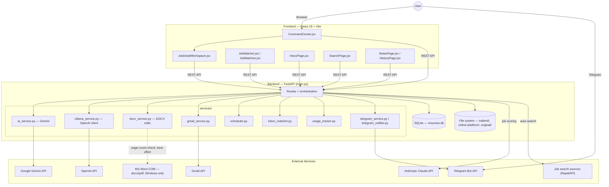
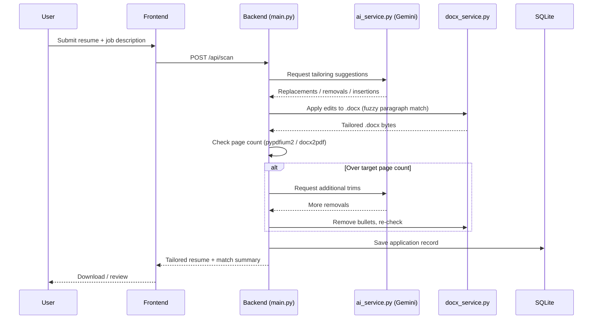

# Job Tailored Resume

An AI-assisted pipeline for tailoring resumes to job descriptions, tracking applications, and monitoring recruiter/interview email threads — with a FastAPI backend and a React dashboard.

## What It Does

Job Tailored Resume automates the repetitive parts of a job search:

- **Resume tailoring** — given a job description and a base `.docx` resume, an LLM (Gemini, with Claude/OpenAI fallback options) proposes bullet replacements, removals, and insertions, which are applied directly to the Word document while preserving formatting. A page-count enforcement loop retries trimming until the tailored resume fits the target page count.
- **Job matching** — scans job postings (via RapidAPI job-search sources) and scores them against your profile/experience, surfacing the best matches in a command-center view.
- **Inbox tracking** — connects to Gmail to detect and label recruiter replies, interview invites, rejections, and exam requests, matching them back to the application they belong to.
- **Timezone / interview-mode awareness** — parses job location and email content to surface the job's local time and whether the interview process is remote, hybrid, or requires in-person attendance.
- **Notifications** — pushes updates to Telegram/WhatsApp so new matches or inbox events don't require checking the dashboard.
- **Cost tracking** — every LLM call is logged (model, tokens, estimated cost) via a shared usage tracker so API spend is auditable.

## Architecture

```
job-trailers-resume/
├── backend/     FastAPI app (Python) — resume tailoring, job matching, Gmail inbox, scheduler
├── frontend/    React + Vite dashboard — command center, job matcher, search, inbox, notes
└── docker-compose.yml   Runs both services together for local development
```

- **Backend**: FastAPI (`backend/main.py`, app title `Job Tailored Resume API`), with feature logic split into `backend/services/` (AI tailoring, docx manipulation, Gmail, scheduler, usage tracking, notifications, etc.). Resumes are edited in-place with `python-docx`; PDF page counts are checked via `pypdfium2`/`docx2pdf` (Windows/Word required for DOCX→PDF conversion).
- **Frontend**: React 19 + Vite, talking to the backend over a local REST API (`http://localhost:8000`). Pages include Command Center, Job Matcher, Search, Inbox, Notes/History, Exam, and Submitted Profile views.
- **Data flow**: job postings → matching/scoring → resume tailoring (LLM + docx edits) → application tracked → Gmail inbox polled/labeled → matched back to the application → dashboard + notifications updated.
- **AI providers**: Gemini (`google-genai`) is the primary model, with Anthropic and OpenAI available as configurable fallbacks (see `model_config.py`).
- **Storage**: a single SQLite table (`resumes`, in `backend/database.py` → `data/resumes.db`) backs every product surface (Resume Tailor, Job Finder, Command Center, manually-added jobs), distinguished by a `source` column, alongside per-company output folders on disk (`trailerd/`, `online-platform/`).

### High-Level Diagram



### Resume Tailoring Flow



### Inbox Matching Flow

```mermaid
sequenceDiagram
    participant Loop as inbox_matcher.py (30-min loop)
    participant Gmail as Gmail API
    participant AI as ai_service.py
    participant DB as SQLite
    participant TG as Telegram

    Loop->>Gmail: Fetch recent messages
    Gmail-->>Loop: Message list
    Loop->>Loop: Heuristic match (domain / company / title)
    Loop->>AI: Classify ambiguous messages
    AI-->>Loop: Category (interview / rejection / exam / other)
    Loop->>DB: Link message to tracked application
    Loop->>TG: Notify on new match
```

## Getting Started

### Prerequisites

- Python 3.13+
- Node.js 22+
- Docker + Docker Compose (optional, for the containerized workflow)
- A Gemini API key (required); Anthropic/OpenAI keys are optional fallbacks
- Google OAuth credentials if you want Gmail inbox tracking
- Windows + Microsoft Word if you run resume tailoring outside Docker (DOCX→PDF conversion uses `docx2pdf`/COM automation)

### Configuration

```bash
cd backend
cp .env.example .env
```

Edit `.env` and fill in at minimum `GEMINI_API_KEY`. See [Configuration](#configuration-1) below for the full variable reference.

### Quick Start (Docker Compose)

```bash
docker-compose up
```

This starts:
- `backend-api` on `http://localhost:8000` (health-checked, 1 CPU / 1GB memory limit)
- `frontend-ui` on `http://localhost:5173` (source is volume-mounted for live editing, waits for the backend to be healthy)

### Manual Development Setup

**Backend:**

```bash
cd backend
pip install -r requirements.txt
uvicorn main:app --reload --port 8000
```

**Frontend:**

```bash
cd frontend
npm install
npm run dev
```

The frontend expects the backend at `http://localhost:8000` — configurable via `ALLOWED_ORIGINS`/`FRONTEND_URL` on the backend side.

## Key Features

- **AI-driven resume tailoring** with exact + fuzzy paragraph matching so bullet replacements land on the correct line even when wording drifts slightly from the job description's suggestion.
- **Page-count enforcement** — iteratively removes lower-priority bullets until the tailored resume fits the requested page count, without corrupting adjacent paragraphs.
- **Job matching and scoring** against your stored profile and tech experience.
- **Gmail inbox integration** with dedicated views for exam requests and submitted-profile confirmations, using Gmail labels.
- **Timezone-aware job cards** — parses job location into an IANA timezone and displays a live local clock; flags in-person-only or unusual interview modes.
- **Command Center** dashboard for triaging matches, sending jobs to the tailoring pipeline, and saving applications.
- **Search & Notes/History** pages for reviewing past applications and free-form notes.
- **Telegram/WhatsApp notifications** for new matches and inbox events.
- **Per-call LLM cost logging** across every AI service function.

## Project Structure

```
backend/
├── main.py                 FastAPI app, routes, resume-tailoring orchestration
├── services/
│   ├── ai_service.py            LLM calls: tailoring, trimming, vendor-contact extraction, etc.
│   ├── docx_service.py          .docx paragraph matching, replacement, removal, insertion
│   ├── gmail_service.py         Gmail API integration
│   ├── inbox_cache.py           Cached inbox state
│   ├── inbox_matcher.py         Matches inbox messages to tracked applications
│   ├── model_config.py          AI provider/model selection and fallback config
│   ├── ollama_service.py        OpenAI client (mail/follow-up drafts) — legacy filename, not actually Ollama
│   ├── profile_service.py       User profile management
│   ├── scan_status.py           Resume-scan job status tracking
│   ├── scheduler.py             Background job scheduling
│   ├── search_cache.py          Job-search result caching
│   ├── tech_experience_service.py  Tech experience data
│   ├── telegram_notifier.py / telegram_service.py   Telegram notifications
│   ├── usage_tracker.py         LLM cost/usage logging (log_api_call)
│   └── whatsapp_service.py      WhatsApp notifications
├── requirements.txt / requirements-dev.txt
├── pytest.ini
└── .env.example

frontend/
└── src/
    ├── App.jsx                 Root component, sidebar navigation
    ├── CommandCenter.jsx        Match triage dashboard
    ├── JobMatcher.jsx / JobMatches.jsx  Job matching views
    ├── JobDetailWorkspace.jsx   Single-job detail/tailoring workspace
    ├── SearchPage.jsx           Search across applications
    ├── InboxPage.jsx            Gmail inbox view
    ├── NotesPage.jsx / HistoryPage.jsx  Notes and application history
    └── LocalTime.jsx            Live local-time-by-timezone display

.github/workflows/
├── ci.yml    Backend (pytest, ruff, pip-audit) + frontend (vitest, eslint, npm audit) + Docker build check
└── cd.yml    Builds and pushes backend/frontend images to GHCR on push to main
```

## Running Tests / CI

**Backend:**

```bash
cd backend
pip install -r requirements-dev.txt
pytest -q
ruff check . --select E9,F
```

**Frontend:**

```bash
cd frontend
npm run test
npm run lint
npm run build
```

CI runs both suites plus a Docker Compose build check on every push and pull request to `main` (see `.github/workflows/ci.yml`). On push to `main`, CD builds and pushes backend/frontend images to GHCR (`.github/workflows/cd.yml`).

## Configuration

Key environment variables from `backend/.env.example` (see that file for the full list and setup instructions):

| Variable | Purpose |
|---|---|
| `ENVIRONMENT` | `development` / `production` mode switch |
| `ALLOWED_ORIGINS` | CORS-allowed frontend origins |
| `ALLOWED_HOSTS` | Allowed `Host` headers |
| `GEMINI_API_KEY` | Primary LLM provider (required) |
| `ANTHROPIC_API_KEY` | Optional fallback LLM provider |
| `OPENAI_API_KEY` | Optional fallback LLM provider |
| `OLLAMA_URL` | Present in `.env.example`; unused by current code (`ollama_service.py` actually calls OpenAI) |
| `GOOGLE_CLIENT_ID` / `GOOGLE_CLIENT_SECRET` | Gmail OAuth credentials |
| `GMAIL_REDIRECT_URI` | OAuth redirect URI for Gmail |
| `FRONTEND_URL` | Frontend base URL used in OAuth redirects |
| `RAPIDAPI_KEY` | Job-search data source |
| `TELEGRAM_BOT_TOKEN` | Telegram notifications |
| `DEBUG` / `LOG_LEVEL` | Logging verbosity |
| `SESSION_LIFETIME_HOURS` | Session expiration |

Never commit a real `.env` file — only `.env.example` (placeholder values) is tracked in the repo.
