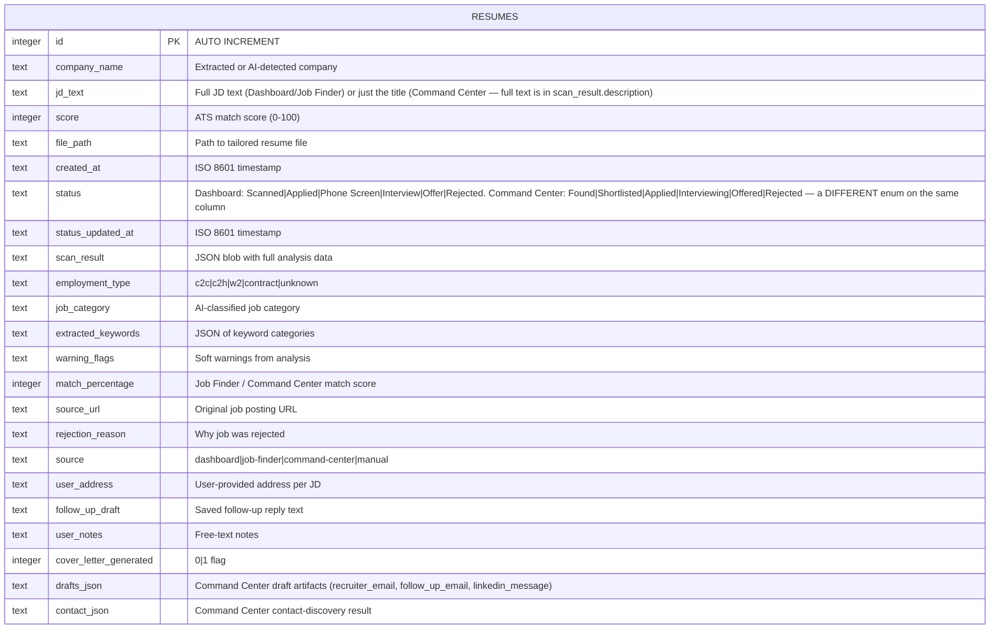
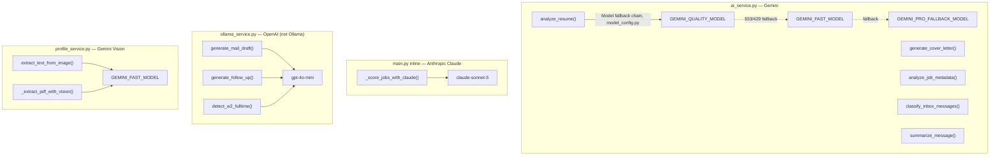
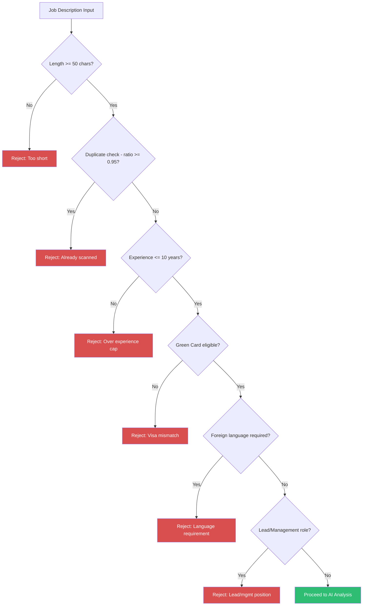

# Backend Architecture

The backend is a single Python FastAPI application (`backend/main.py`, ~5,000 lines) with service modules in `backend/services/`. There is no router-file split — a `backend/routers/` directory exists but only contains stale `__pycache__/*.pyc` files with no corresponding `.py` source; `main.py` has zero `include_router` calls. Everything genuinely lives in the one file.

## Class Diagram

```mermaid
classDiagram
    class MainApp {
        +FastAPI app
        +Limiter limiter
        -_TECH_TOOLS: set
        -_JOB_TITLE_WORDS: set
        -_GENERIC_EMAIL: set
        +RESUME_FILENAME: str
        +read_root() dict
        +scan_resume(jd_text, resume, selected_resume, ai_notes) dict
        +batch_scan(body: BatchScanRequest) dict
        +get_history(limit, offset) list
        +search_history(q, limit) dict
        +api_generate_cover_letter(record_id) dict
        +api_generate_mail_draft(record_id) dict
        +api_generate_follow_up(record_id, body) dict
        +auto_search_jobs(body) dict
        +get_job_detail(job_id) dict
        +rescore_job(job_id) dict
        +tailor_job(job_id) dict
        +get_command_center_dashboard() dict
        -_extract_company_name(jd_text) str
        -_extract_experience_years(jd_text) int
        -_check_visa_eligibility(jd_text) str|None
        -_check_lead_role(jd_text) str|None
        -_check_foreign_language(jd_text) str|None
        -_check_employment_type(jd_text) tuple
        -_scrape_jd_from_url(url) str
        -_scan_resume_core(...) dict
        -_process_single_jd(jd_text, file_bytes, original_filename, ai_notes) dict
        -_make_company_dir(company_name, email, root) str
        -_resolve_resume_path(record) str|None
        -_convert_docx_to_pdf(docx_path) str|None
        -_score_jobs_with_claude(job_texts, query) list
        -_run_command_center_search(...) dict
        +extract_job_keywords(jd_text) dict
        +calculate_match_score(years, keywords, emp_type) int
    }

    class Database {
        +DB_FILE: str
        +init_db()
        +save_resume_record(company, jd, score, path, scan_result) int
        +save_job_matcher_record(company, jd, match_pct, can_apply, reason, url, scan) int
        +get_resume_by_id(record_id) dict
        +get_all_resumes(limit, offset) list
        +find_existing_company(company_name) dict|None
        +delete_resume_record(record_id)
        +search_records(query, limit) list
        +update_resume_status(record_id, status)
        +update_job_description(record_id, description)
        +update_resume_rerun(record_id, company, jd, score, scan_result)
        +link_tailored_resume(record_id, file_path)
        +save_found_job(...) int
        +get_found_jobs(limit, offset) list
        +save_rejected_job(...) int
        +save_manual_job(...) int
        +clear_command_center_jobs()
        +get_job_source_breakdown() dict
        +get_career_intel() dict
        +update_job_score(job_id, score, reasons, tags)
        +save_job_draft(job_id, draft_type, content)
        +save_job_contact(job_id, contact)
        +save_application_from_job(job_id) int
        +get_action_queue() dict
        +get_active_applications() list
        +update_user_address(record_id, address)
        +update_user_notes(record_id, notes)
        +mark_cover_letter_generated(record_id)
        +save_follow_up_draft(record_id, subject, body)
        +get_follow_up_draft(record_id) dict
        +get_all_addresses() list
        +sanitize_csv_field(field) str
    }

    class AIService {
        +analyze_resume(resume_text, jd_text, ai_notes) dict
        +generate_cover_letter(resume_text, jd_text, company_name) str
        +analyze_job_metadata(jd_text, extracted_keywords) dict
        +classify_inbox_messages(messages) list
        +summarize_message(message, thread) dict
    }

    class OllamaService {
        note "Despite the filename, this wraps the OpenAI SDK — not Ollama."
        +generate_mail_draft(resume, jd, cover_letter, company, profile) dict
        +generate_follow_up(resume, jd, company, email, original_mail, profile, conversation, is_w2) dict
        +detect_w2_fulltime(email_text) bool
        -_extract_recruiter_name(jd_text) str
        -_extract_job_title(jd_text) str
    }

    class DocxService {
        +extract_text_from_docx(file_bytes) str
        +create_tailored_docx(original_bytes, replacements) BytesIO
        -replace_text_in_paragraph(paragraph, original, new) bool
        -_find_best_paragraph_match(paragraphs, original) tuple
        -_replace_entire_paragraph(paragraph, new_text)
        -_replace_across_runs(paragraph, original, new) bool
    }

    class GmailService {
        +get_auth_url() str
        +handle_callback(auth_code) dict
        +is_connected() dict
        +disconnect() dict
        +save_draft(to_emails, subject, body, attachment_path, attachments) dict
        +search_inbox(query, max_results) list
        +get_message_body(message_id) dict
        +get_thread(thread_id) dict
        +get_conversation_with_sender(email, max_results) list
        +apply_label(message_id, label) dict
        +archive_message(message_id) dict
        +mark_read(message_id) dict
    }

    class TelegramService {
        +is_configured() bool
        +send_message(chat_id, text)
        +send_message_sync(chat_id, text)
        +answer_callback_query(callback_id)
        +get_me() dict
        +get_updates(offset, timeout) list
    }

    class Scheduler {
        +get_schedule_info() dict
        +set_schedule(enabled, hour, minute)
        +daily_search_loop(search_fn) coroutine
    }

    class InboxMatcher {
        +check_inbox_for_replies() list
        +get_unhandled_inbox_replies() list
        +mark_inbox_reply_handled(message_id)
        +inbox_reply_check_loop() coroutine
    }

    class ProfileService {
        +process_uploaded_doc(file_bytes, filename) dict
        +extract_text_from_pdf(file_bytes) str
        +extract_text_from_image(file_bytes, filename) str
        -_extract_pdf_with_vision(file_bytes) str
    }

    class UsageTracker {
        +PRICING: dict
        +JSEARCH_FREE_MONTHLY_LIMIT: int
        +log_api_call(model, operation, input_tokens, output_tokens) float
        +get_usage_stats() dict
    }

    MainApp --> AIService : analyze_resume, generate_cover_letter, classify_inbox
    MainApp --> OllamaService : generate_mail_draft, generate_follow_up
    MainApp --> DocxService : extract_text, create_tailored_docx
    MainApp --> GmailService : auth, save_draft, inbox
    MainApp --> TelegramService : send_message, poll_loop
    MainApp --> Scheduler : daily_search_loop
    MainApp --> InboxMatcher : inbox_reply_check_loop
    MainApp --> ProfileService : process_uploaded_doc
    MainApp --> UsageTracker : get_usage_stats
    MainApp --> Database : CRUD operations
    MainApp --> Claude : _score_jobs_with_claude (inline, no service file)
    AIService --> UsageTracker : log_api_call
    OllamaService --> UsageTracker : log_api_call
    ProfileService --> UsageTracker : log_api_call
```



## Database Schema

The system uses a single SQLite table (`data/resumes.db`, table `resumes`) with additive-only migrations (`ALTER TABLE ADD COLUMN`, each wrapped in a try/except so re-running `init_db()` is always safe). **All four products share this one table**, distinguished by the `source` column — see [System Architecture](System_Architecture.md#the-four-products-one-table).



### Key Fields

- **`scan_result`** (JSON): For Dashboard/Job Finder records — `score`, `after_score`, `missing_keywords`, `section_scores` (Skills/Experience/Education/Summary), `contact_info` (name/email/phone), `replacements`. For Command Center records — `description` (the real JD text), `reasons`, `tags`, `next_action`, plus employer metadata scraped/scored by Claude.
- **`source`**: `dashboard` (Resume Tailor), `job-finder` (standalone pre-screen), `command-center` (auto-discovered), `manual` (user-added). Determines which status enum and which UI reads the record.
- **`status`**: Two different valid-value sets depending on `source` — see the ER diagram note above. This is intentional (see `JOB_STATUS_VALUES` comment, `main.py` ~line 3905), not a bug, but don't assume one enum covers both.
- **`file_path`**: Points into either `trailerd/<company>/` (Dashboard/Job Finder) or `online-platform/<company>_<job_id>/` (Command Center — see `_job_artifact_dir`). Can go stale (see "Resume File Resolution" below) — always prefer `_resolve_resume_path()` over reading this column directly when you need to actually open the file.

## AI Service Pipeline — Three Providers, Three Distinct Jobs



Only Command Center job scoring goes through Claude — everything resume/cover-letter/mail-related stays on Gemini + OpenAI. There is no `claude_service.py`; the call is inline in `main.py`.

### AI Response Format (analyze_resume)

```json
{
    "score": 62,
    "after_score": 85,
    "company_name": "TechCorp Inc",
    "missing_keywords": ["Terraform", "Ansible", "GitOps"],
    "section_scores": {
        "Skills": 70,
        "Experience": 65,
        "Education": 80,
        "Summary": 55
    },
    "contact_info": {
        "name": "John Smith",
        "email": "john@techcorp.com",
        "phone": "555-123-4567"
    },
    "replacements": [
        {
            "original": "Managed cloud infrastructure using AWS services",
            "new": "Managed cloud infrastructure using AWS services including EC2, S3, Lambda, and Terraform IaC pipelines",
            "keywords_added": ["Terraform", "IaC", "Lambda"]
        }
    ]
}
```

## JD Pre-Screening Pipeline

Applied independently at **four call sites** — `/api/scan`, `/api/batch-scan`, the Telegram JD handler, and the Command Center auto-search pipeline. There is no single shared validator function; each call site invokes the same helper functions itself.



## Resume File Resolution (`_resolve_resume_path`)

`resumes.file_path` is not always safe to open directly — it can go stale relative to what's actually on disk:

- **Windows trailing-dot/space bug**: a folder named `trailerd/ATSIT_Inc.` (note the trailing period — common for "Inc.", "LLC.", "Corp." company names) is created fine by `os.makedirs`, but Windows' Win32 API silently strips the trailing dot on every subsequent lookup (`os.path.exists`, `os.path.isdir`, `open`, `os.listdir`), so the file looks permanently missing even though it's right there. Worse, the dot-stripped name can collide case-insensitively with a *different* company's folder, silently misattributing a file.
- **Legacy flat-file paths**: some historical records store `trailerd/<Company>.docx` directly (no per-company subfolder), predating the current folder-per-company convention.

`_make_company_dir()` now strips trailing dots/spaces from every new folder name so this can't recur, but existing bad paths still need resolving at read time. `_resolve_resume_path(record)`:

1. Returns `record['file_path']` as-is if it exists.
2. Otherwise searches (in order): a company-name-derived folder, the stored path's own directory, and the stored path with its extension treated as a directory name (the legacy flat-file case) — for the first `.docx` found that isn't a cover letter.
3. Deliberately **skips** the company-name-derived candidate when the company name is a generic placeholder (`"Unknown"`, `"Unknown Company"`, ...), since many unrelated records share that name and matching on it would misattribute a stranger's file.
4. If it finds the file somewhere other than the stored path, it self-heals the DB record via `link_tailored_resume()` so future lookups skip the fallback.

Every endpoint that opens a tailored resume (cover letter generation, mail draft generation/save, add-points, follow-up, Gmail attachment, Telegram cover-letter/mail-draft/Gmail-draft, `/api/history` PDF-path lookup) goes through this helper rather than reading `file_path` directly.

## PDF Generation

Alongside the tailored `.docx`, `_convert_docx_to_pdf()` (`main.py`) produces a sibling `.pdf` via `docx2pdf`, which drives MS Word through COM automation. This is:

- **Windows + MS Word only.** `docx2pdf`/`pywin32` are pinned in `requirements.txt` with `; sys_platform == "win32"`, so the Linux/Alpine Docker image never tries to install them — PDF generation just silently no-ops there (best-effort, wrapped in try/except, never blocks the scan).
- Called once per scan, right after the resume file is finalized, in both `_scan_resume_core` (used by `/api/scan`, reruns, Command Center tailoring) and `_process_single_jd` (used by `/api/batch-scan`).
- Deterministic: the PDF path is always the `.docx` path with its extension swapped, so nothing needs to persist it separately — `/api/history` computes `pdf_path` on the fly per record and only includes it if the file actually exists on disk.

## File System Structure

```
backend/
├── main.py                    # FastAPI app, routes, business logic (~5000 lines)
├── database.py                # SQLite CRUD operations (single `resumes` table)
├── routers/                   # Vestigial — __pycache__ only, no .py source, unused
├── _run.py                    # Simple uvicorn launcher
├── check_models.py            # Gemini model availability checker
├── test_job_matcher.py        # Integration tests for Job Matcher
├── services/
│   ├── ai_service.py          # Gemini — resume analysis, cover letters, inbox classification
│   ├── ollama_service.py      # OpenAI (not Ollama) — mail drafts, follow-ups
│   ├── docx_service.py        # DOCX parsing and generation
│   ├── gmail_service.py       # Gmail OAuth2 and API
│   ├── telegram_service.py    # Telegram HTTP client (send/poll)
│   ├── telegram_notifier.py   # Action-queue digest + daily digest, 30-min loop
│   ├── profile_service.py     # Document OCR and fact extraction
│   ├── usage_tracker.py       # API cost tracking (Gemini + Claude + OpenAI + JSearch quota)
│   ├── scheduler.py           # Daily auto-search schedule + loop
│   ├── inbox_matcher.py       # Reply-to-application matching, 30-min loop
│   ├── inbox_cache.py         # Inbox AI-classification cache
│   ├── scan_status.py         # Last auto-search bookkeeping
│   ├── model_config.py        # Named Gemini model constants
│   ├── whatsapp_service.py    # Dead code — complete but never imported
│   └── search_cache.py        # Dead code — never wired into auto-search
├── data/                      # Runtime data directory
│   ├── resumes.db             # SQLite database
│   ├── history.csv            # Append-only history log
│   ├── api_usage.json         # API usage/cost tracking
│   ├── profile.txt            # User profile facts
│   ├── gmail_tokens.json      # Gmail OAuth tokens
│   ├── documents/             # Uploaded personal docs (DL, GC)
│   ├── last_scan.json, daily_search_schedule.json, telegram_notified_ids.json,
│   │   inbox_classify_cache.json, inbox_reply_seen.json, inbox_reply_matches.json
│   └── logs/                  # Application logs
├── original/                  # Uploaded base resumes
├── trailerd/                  # Dashboard/Job Finder output
│   └── <Company_Name>/
│       ├── Teja_Mahesh_Neerukonda_Resume.docx  # Tailored resume
│       ├── Teja_Mahesh_Neerukonda_Resume.pdf   # Matching PDF (best-effort, Windows only)
│       ├── jd_info.txt        # JD + contact info
│       ├── difference.txt     # Before/after diff
│       ├── cover_letter_*.docx
│       └── mail_draft_*.txt
└── online-platform/           # Command Center output
    └── <Company_Name>_<job_id>/   # Deterministic per-job folder (not a name-dedup counter)
        └── (same artifact types as trailerd/)
```
