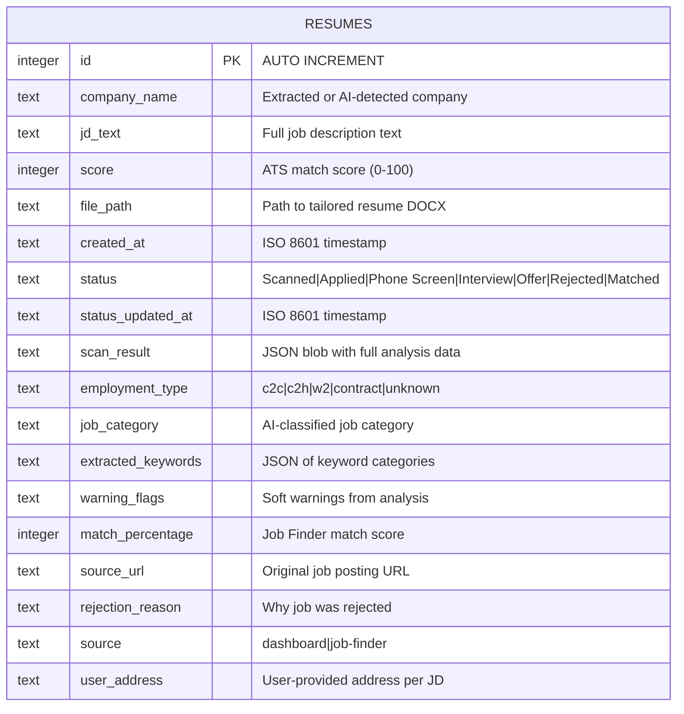
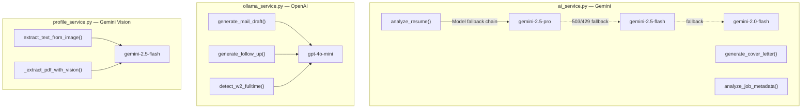

# Backend Architecture

The backend is a Python FastAPI application (`backend/main.py`) with service modules in `backend/services/`. It acts as the orchestrator — receiving requests, applying business rules, delegating to AI services, and managing file/database operations.

## Class Diagram

```mermaid
classDiagram
    class MainApp {
        +FastAPI app
        +Limiter limiter
        -_TECH_TOOLS: set
        -_JOB_TITLE_WORDS: set
        -_GENERIC_EMAIL: set
        +read_root() dict
        +scan_resume(jd_text, resume, selected_resume, ai_notes) dict
        +batch_scan(body: BatchScanRequest) dict
        +get_history(limit, offset) list
        +search_history(q, limit) dict
        +analyze_job(jd_text, source_url) dict
        +api_generate_cover_letter(record_id) dict
        +api_generate_mail_draft(record_id) dict
        +api_generate_follow_up(record_id, body) dict
        -_extract_company_name(jd_text) str
        -_extract_experience_years(jd_text) int
        -_check_visa_eligibility(jd_text) str|None
        -_check_lead_role(jd_text) str|None
        -_check_foreign_language(jd_text) str|None
        -_check_employment_type(jd_text) tuple
        -_scrape_jd_from_url(url) str
        -_process_single_jd(jd_text, file_bytes, original_filename, ai_notes) dict
        -_make_company_dir(company_name, email) str
        +extract_job_keywords(jd_text) dict
        +calculate_match_score(years, keywords, emp_type) int
    }

    class Database {
        +DB_FILE: str
        +init_db()
        +save_resume_record(company, jd, score, path, scan_result) int
        +save_job_matcher_record(company, jd, match_pct, can_apply, reason, url, scan) int
        +get_resume_by_id(record_id) dict
        +get_all_resumes(limit, offset) list
        +find_existing_company(company_name) dict|None
        +delete_resume_record(record_id)
        +search_records(query, limit) list
        +update_resume_status(record_id, status)
        +update_user_address(record_id, address)
        +get_all_addresses() list
        +sanitize_csv_field(field) str
    }

    class AIService {
        +analyze_resume(resume_text, jd_text, ai_notes) dict
        +generate_cover_letter(resume_text, jd_text, company_name) str
        +analyze_job_metadata(jd_text, extracted_keywords) dict
    }

    class OllamaService {
        +generate_mail_draft(resume, jd, cover_letter, company, profile) dict
        +generate_follow_up(resume, jd, company, email, original_mail, profile, conversation, is_w2) dict
        +detect_w2_fulltime(email_text) bool
        -_extract_recruiter_name(jd_text) str
        -_extract_job_title(jd_text) str
    }

    class DocxService {
        +extract_text_from_docx(file_bytes) str
        +create_tailored_docx(original_bytes, replacements) BytesIO
        -replace_text_in_paragraph(paragraph, original, new) bool
        -_find_best_paragraph_match(paragraphs, original) tuple
        -_replace_entire_paragraph(paragraph, new_text)
        -_replace_across_runs(paragraph, original, new) bool
    }

    class GmailService {
        +get_auth_url() str
        +handle_callback(auth_code) dict
        +is_connected() dict
        +disconnect() dict
        +save_draft(to_emails, subject, body, attachment_path, attachments) dict
        +search_inbox(query, max_results) list
        +get_message_body(message_id) dict
        +get_conversation_with_sender(email, max_results) list
    }

    class TelegramService {
        +is_configured() bool
        +send_message(chat_id, text)
        +send_message_sync(chat_id, text)
        +get_me() dict
        +get_updates(offset, timeout) list
    }

    class ProfileService {
        +process_uploaded_doc(file_bytes, filename) dict
        +extract_text_from_pdf(file_bytes) str
        +extract_text_from_image(file_bytes, filename) str
        -_extract_pdf_with_vision(file_bytes) str
    }

    class UsageTracker {
        +PRICING: dict
        +log_api_call(model, operation, input_tokens, output_tokens) float
        +get_usage_stats() dict
    }

    class StatusUpdate {
        +status: str
    }

    class BatchScanRequest {
        +jd_texts: List~str~
        +selected_resume: str
        +ai_notes: Optional~str~
    }

    class MailDraftSave {
        +subject: str
        +body: str
    }

    class GmailDraftRequest {
        +to_emails: list
        +subject: str
        +body: str
        +record_id: Optional~int~
        +attach_resume: bool
        +attach_cover_letter: bool
        +attach_dl: bool
        +attach_gc: bool
    }

    class FollowUpRequest {
        +received_email: str
    }

    class ProfileUpdate {
        +content: str
    }

    class AddressUpdate {
        +address: str
    }

    MainApp --> AIService : analyze_resume, generate_cover_letter
    MainApp --> OllamaService : generate_mail_draft, generate_follow_up
    MainApp --> DocxService : extract_text, create_tailored_docx
    MainApp --> GmailService : auth, save_draft, search_inbox
    MainApp --> TelegramService : send_message, poll_loop
    MainApp --> ProfileService : process_uploaded_doc
    MainApp --> UsageTracker : get_usage_stats
    MainApp --> Database : CRUD operations
    AIService --> UsageTracker : log_api_call
    OllamaService --> UsageTracker : log_api_call
    ProfileService --> UsageTracker : log_api_call
```



## Database Schema

The system uses a single SQLite table with progressive migrations.



### Key Fields

- **`scan_result`** (JSON): Contains the full AI analysis including `score`, `after_score`, `missing_keywords`, `section_scores` (Skills/Experience/Education/Summary), `contact_info` (name/email/phone), and `replacements` (original/new/keywords_added).
- **`source`**: Distinguishes between records created from the Resume Tailor dashboard vs. the Job Finder.
- **`status`**: Tracks application lifecycle. Valid values: `Scanned`, `Applied`, `Phone Screen`, `Interview`, `Offer`, `Rejected`, `Matched`.

## AI Service Pipeline



### AI Response Format (analyze_resume)

```json
{
    "score": 62,
    "after_score": 85,
    "company_name": "TechCorp Inc",
    "missing_keywords": ["Terraform", "Ansible", "GitOps"],
    "section_scores": {
        "Skills": 70,
        "Experience": 65,
        "Education": 80,
        "Summary": 55
    },
    "contact_info": {
        "name": "John Smith",
        "email": "john@techcorp.com",
        "phone": "555-123-4567"
    },
    "replacements": [
        {
            "original": "Managed cloud infrastructure using AWS services",
            "new": "Managed cloud infrastructure using AWS services including EC2, S3, Lambda, and Terraform IaC pipelines",
            "keywords_added": ["Terraform", "IaC", "Lambda"]
        }
    ]
}
```

## JD Pre-Screening Pipeline

The system applies rule-based filters before any AI processing:


## File System Structure

```
backend/
├── main.py                    # FastAPI app, routes, business logic (~2500 lines)
├── database.py                # SQLite CRUD operations
├── _run.py                    # Simple uvicorn launcher
├── check_models.py            # Gemini model availability checker
├── test_job_matcher.py        # Integration tests for Job Matcher
├── services/
│   ├── ai_service.py          # Gemini-based resume analysis
│   ├── ollama_service.py      # OpenAI-based email drafting
│   ├── docx_service.py        # DOCX parsing and generation
│   ├── gmail_service.py       # Gmail OAuth2 and API
│   ├── telegram_service.py    # Telegram Bot long-polling
│   ├── profile_service.py     # Document OCR and fact extraction
│   ├── usage_tracker.py       # API cost tracking
│   └── whatsapp_service.py    # WhatsApp integration (placeholder)
├── data/                      # Runtime data directory
│   ├── resumes.db             # SQLite database
│   ├── history.csv            # Append-only history log
│   ├── api_usage.json         # API usage/cost tracking
│   ├── profile.txt            # User profile facts
│   ├── gmail_tokens.json      # Gmail OAuth tokens
│   ├── documents/             # Uploaded personal docs (DL, GC)
│   └── logs/                  # Application logs
├── original/                  # Uploaded base resumes
└── trailerd/                  # Output directory
    └── <Company_Name>/
        ├── resume.docx        # Tailored resume
        ├── jd_info.txt        # JD + contact info
        ├── difference.txt     # Before/after diff
        ├── cover_letter_*.docx
        └── mail_draft_*.txt
```
