# Data Flow & Sequence Diagrams

## 1. Resume Scan — Full Pipeline (Dashboard)

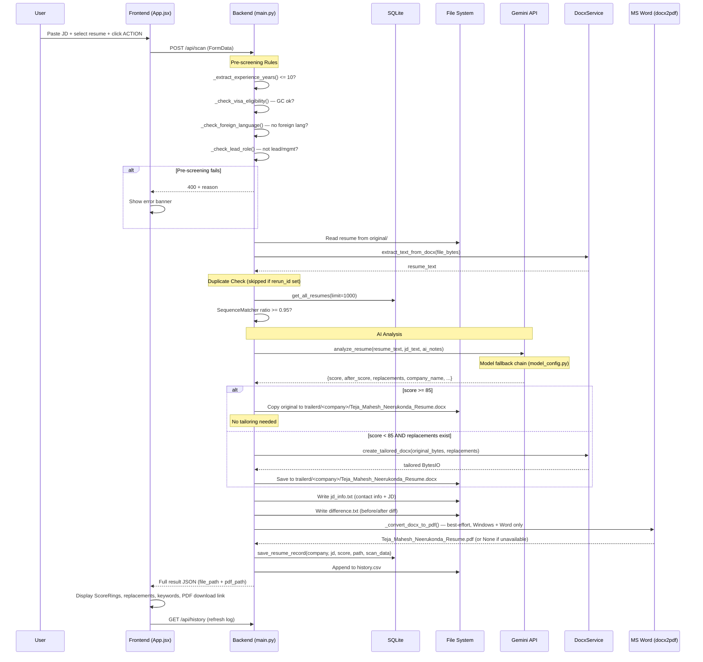

## 2. Batch Scan Pipeline

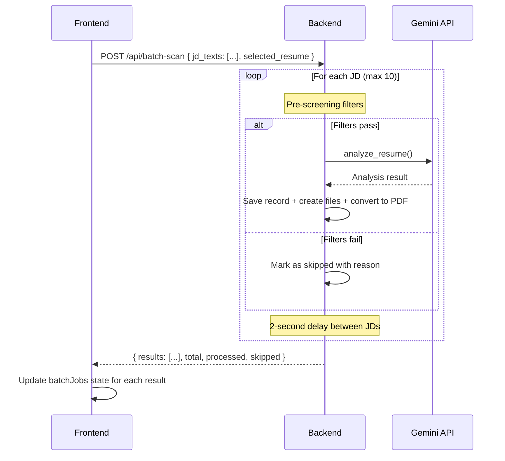

## 3. Job Finder Analysis (standalone pre-screen — not Command Center)

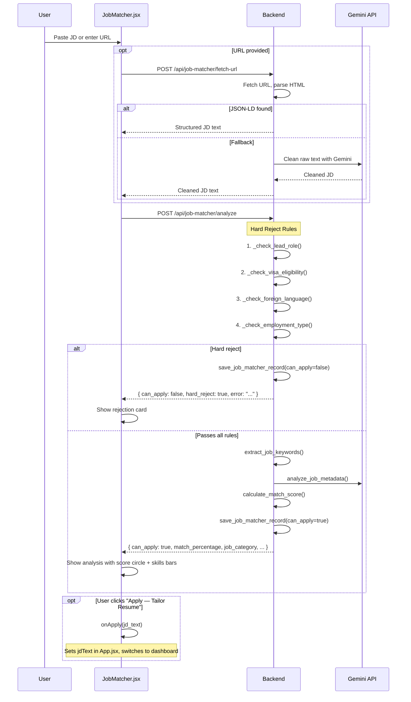

## 4. Command Center Auto-Search + Claude Scoring

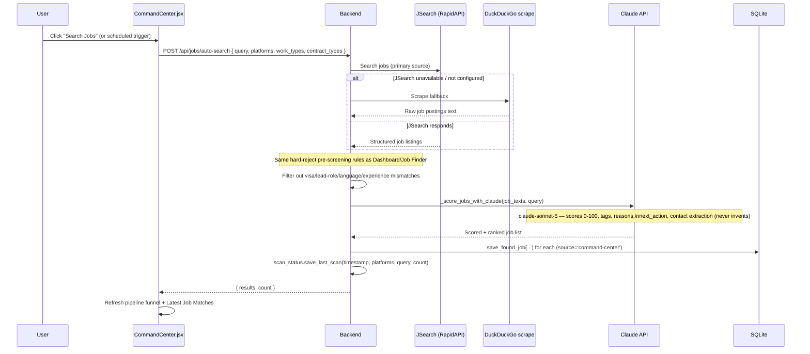

## 5. Match Center — Tailor a Command Center Job

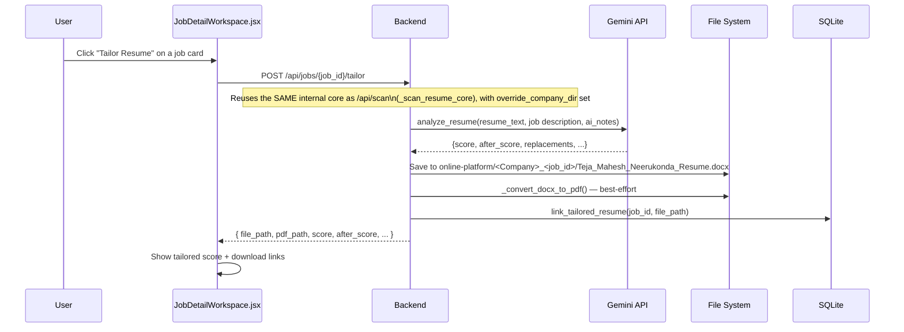

## 6. Email Draft + Gmail Integration

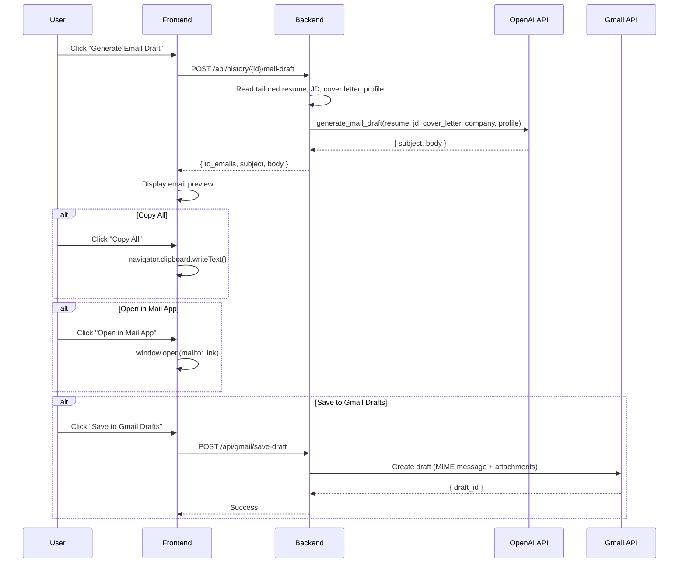

## 7. Follow-Up Reply (with W2 Auto-Detection)

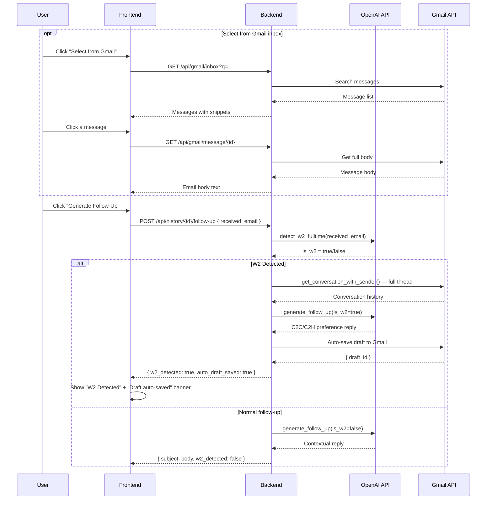

## 8. Inbox AI Classification + Application Matching

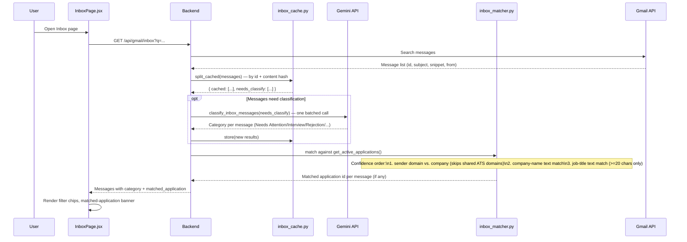

## 9. Background Loops (started at FastAPI startup)

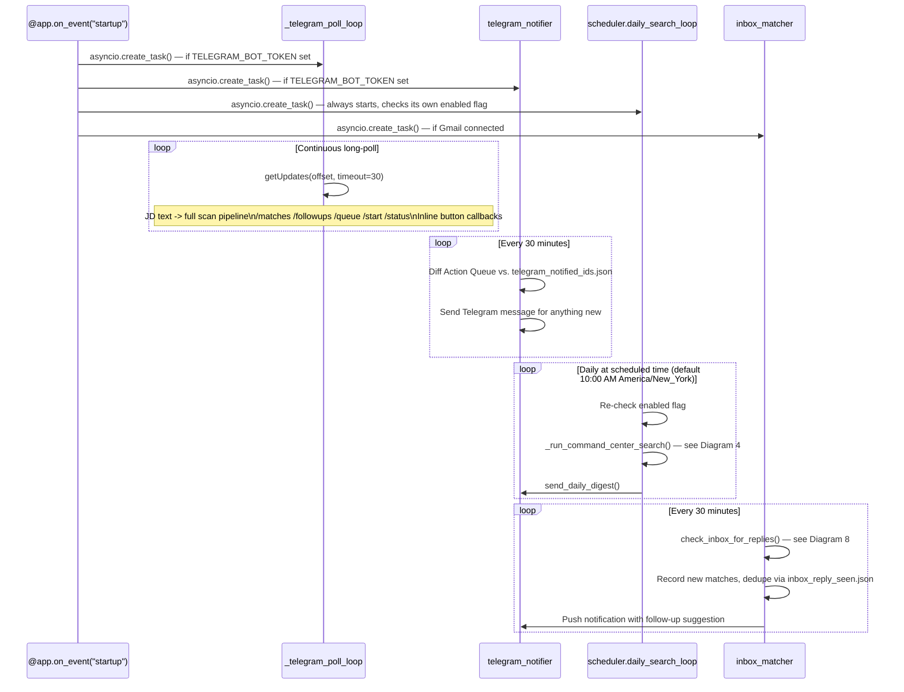

## 10. Telegram Bot Processing (JD scanning path)

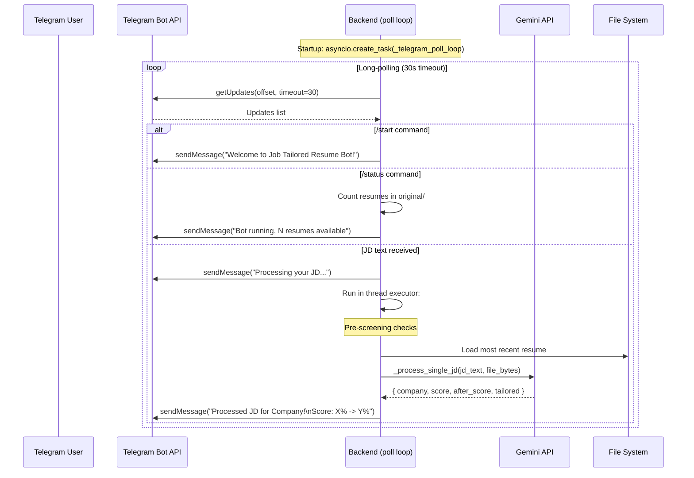

## 11. Company Name Extraction Priority

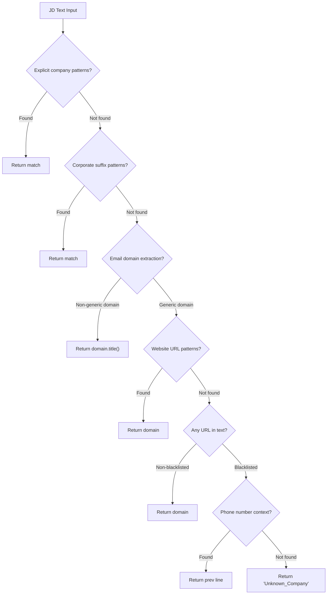

## 12. DOCX Tailoring — Text Replacement Strategy

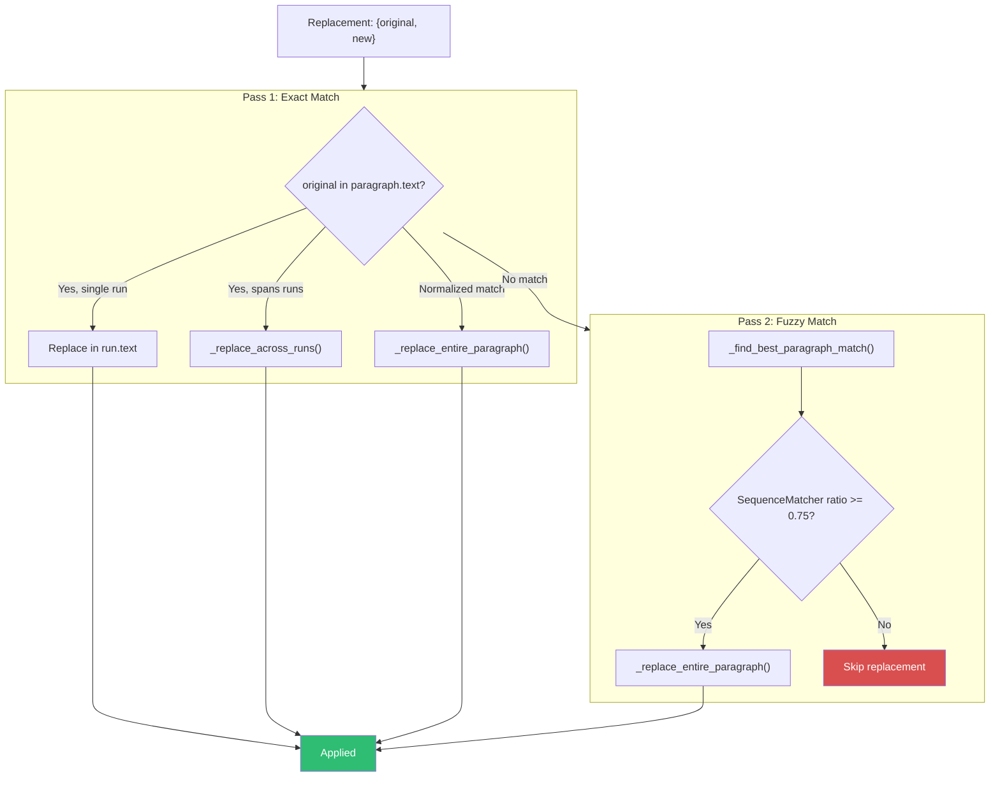

## 13. Resume File Resolution Fallback (`_resolve_resume_path`)

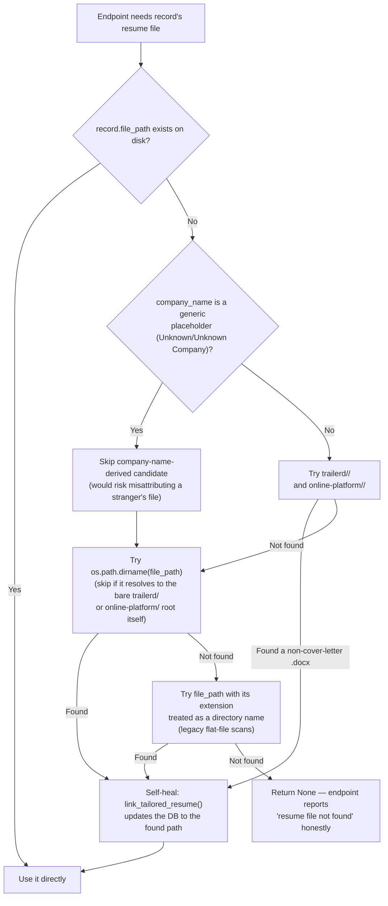
