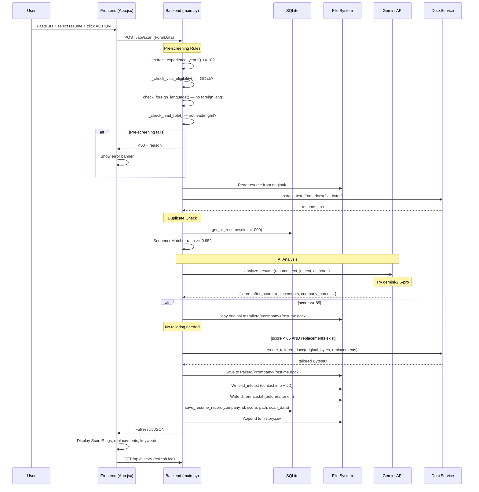
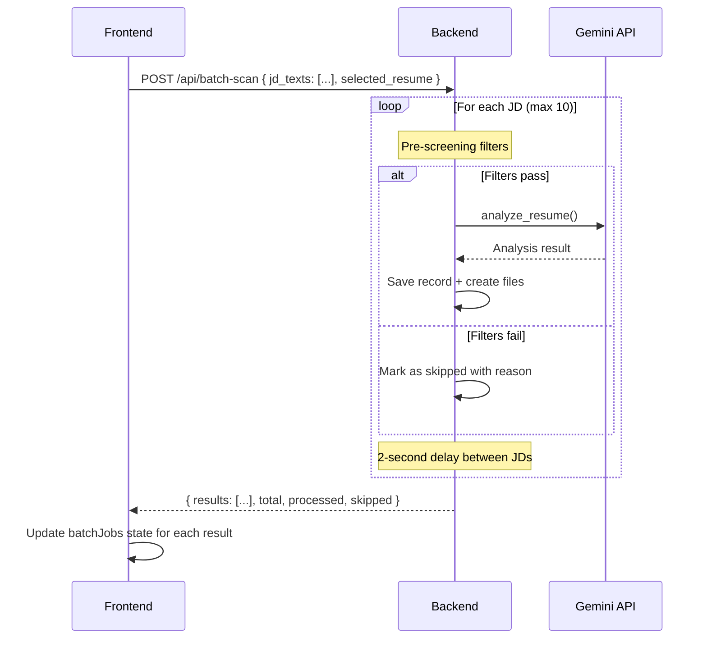
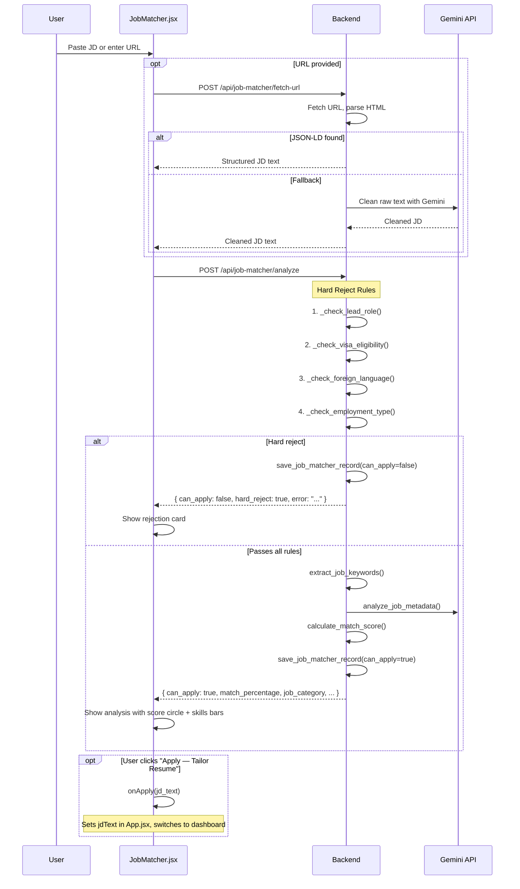
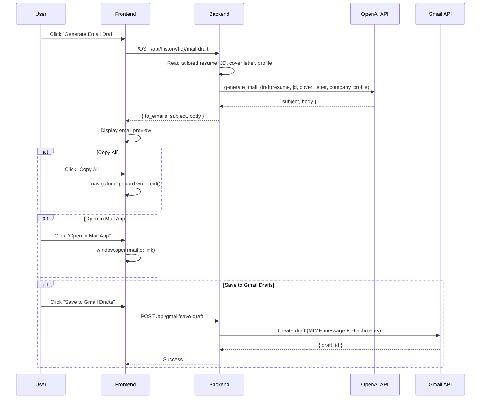
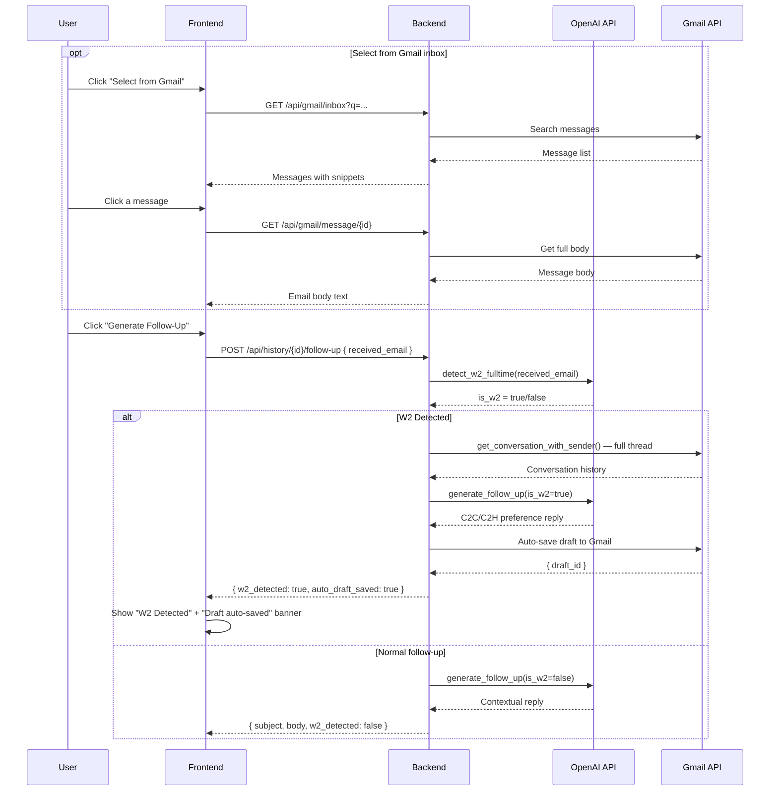
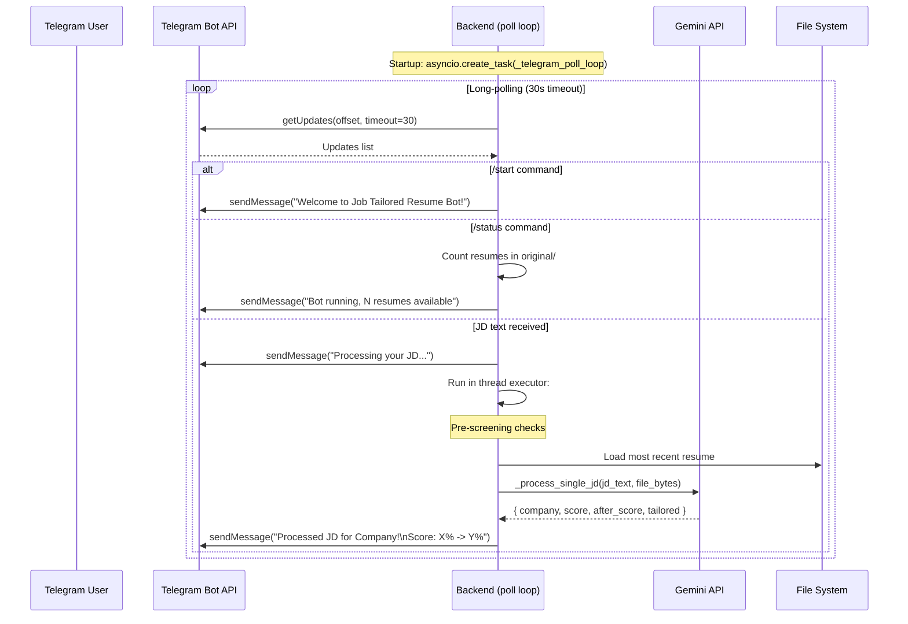
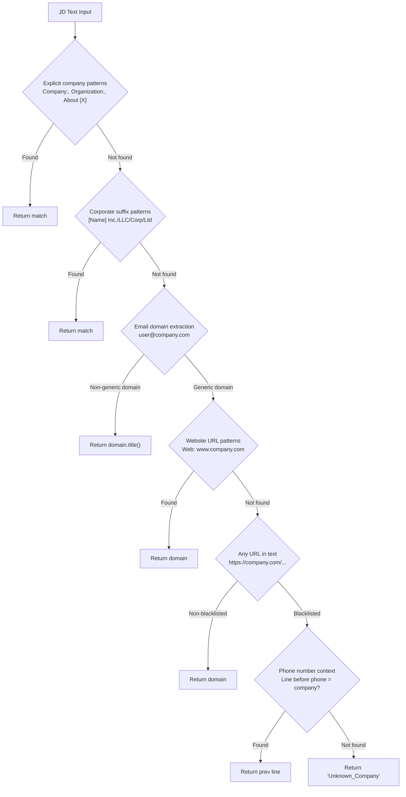
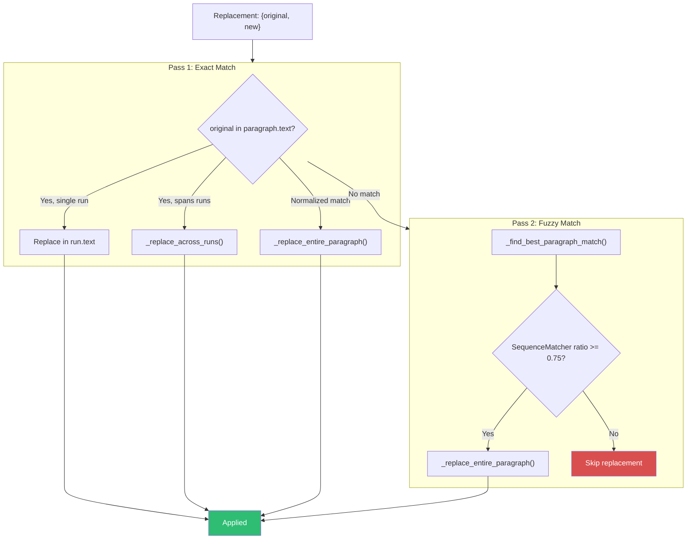

# Data Flow & Sequence Diagrams

## 1. Resume Scan — Full Pipeline

## 2. Batch Scan Pipeline

## 3. Job Finder Analysis

## 4. Email Draft + Gmail Integration

## 5. Follow-Up Reply (with W2 Auto-Detection)

## 6. Telegram Bot Processing

## 7. Company Name Extraction Priority

## 8. DOCX Tailoring — Text Replacement Strategy

