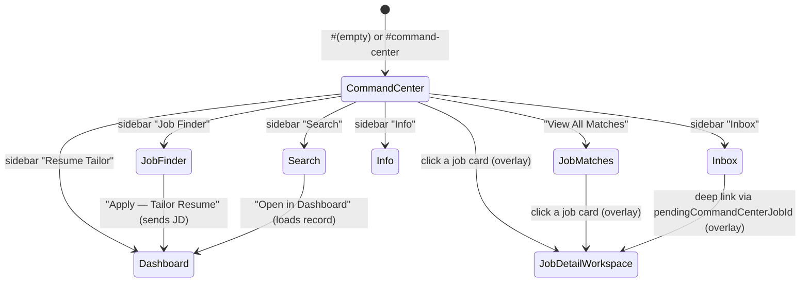
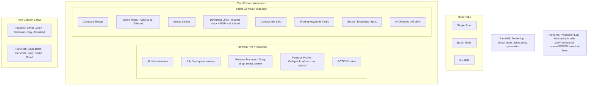
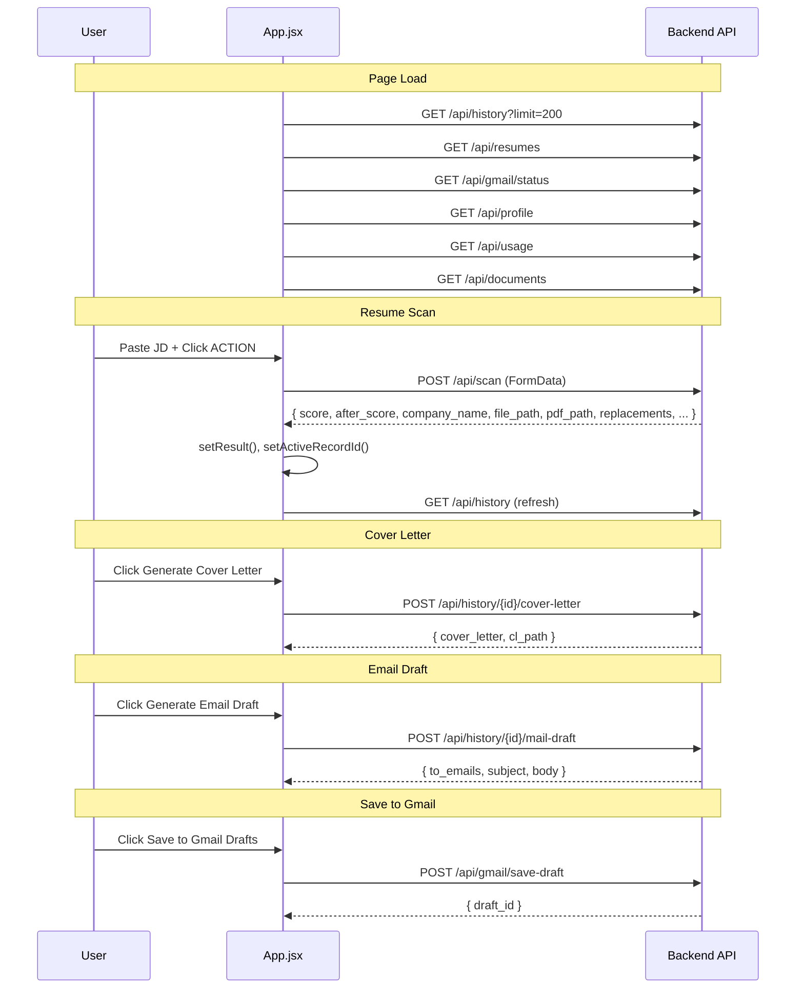

# Frontend Architecture

The frontend is a React 19 Single Page Application built with Vite 8. It uses vanilla CSS with CSS custom properties for theming — no external UI library, no React Router, and no state-management library (no Context, Redux, Zustand, etc.). Every page manages its own state via plain `useState`/`useEffect`/`useRef`.

## Component Inventory

| File | ~Lines | Role |
|------|--------|------|
| `App.jsx` | 2265 | Root component and central state container for the Resume Tailor dashboard (scan, batch mode, cover letter/mail/follow-up, history/production log, Gmail, profile, personal docs, usage) **and** the standalone Info page (Telegram status, saved addresses). Also owns page-level navigation. |
| `CommandCenter.jsx` | 927 | The app's default/home view — pipeline funnel, filters, auto-search trigger, Action Queue, metric cards, Latest Job Matches, footer panels (Automation Status, Job Source Health, Career Intel). Exports the shared `JobRow` component and an `AddJobModal`. |
| `JobDetailWorkspace.jsx` | 551 | Modal overlay opened from Command Center, `JobMatches`, or `InboxPage` for one job: AI next-best-action, match explanation, contact discovery, AI action grid (rescore/tailor/cover letter/recruiter email/follow-up/LinkedIn message/find contact), draft editors with Gmail-save, notes, status tracker. |
| `JobMatcher.jsx` | 863 | "Job Finder" page — single JD/URL pre-screen with a match-analysis or hard-reject screen, independent of Command Center's auto-discovery. Mostly inline `styles` objects. |
| `JobMatches.jsx` | 105 | Paginated (20/page) list of every Command Center "Found" job, reusing `JobRow`; opens `JobDetailWorkspace` on click. |
| `InboxPage.jsx` | 541 | Gmail inbox browser: category filter chips, Smart/Cheap AI-sort toggle, message list + reader pane, matched-application banner with pipeline status buttons, AI summary/reply generation, label/archive/mark-read actions. |
| `SearchPage.jsx` | 305 | Full-text search across all records; inline-editable address/notes per result; "Open in Dashboard" hands a record to `App`. |
| `main.jsx` | 10 | Entry point — mounts `<App />` in `<StrictMode>`. |

Non-component files: `App.css`, `index.css` (global theme), `test/setup.js` (vitest + testing-library setup), `assets/`.

## Navigation — No Router, Hash-Persisted View Switching

There is no React Router. `App.jsx` holds a `currentPage` string, persisted to `window.location.hash` (so a page refresh stays put), and the render body is a chain of `if (currentPage === '...') return (...)` blocks — each wrapping the same persistent left sidebar plus a different main view.

### Sidebar Navigation

All pages share a persistent left sidebar with six navigation items:
- **Command Center** — home, job discovery pipeline
- **Resume Tailor** — the original single/batch scan dashboard
- **Job Finder** — standalone pre-screening
- **Search** — full-text search
- **Inbox** — Gmail inbox browser
- **Info** — employer details, Telegram bot status, saved addresses

## Dashboard Layout (App.jsx — "Resume Tailor" view)

Batch Mode processes up to 10 JDs (typed or a `.txt` file split on `---`) sequentially against one selected resume, with a live per-job progress list (score, download links including PDF, "CL+✉" shortcut into the CL/mail panels).

## State Management

No Context/Redux/Zustand anywhere — plain `useState`/`useEffect`/`useRef`, with data passed down via props and callbacks. Rough state sizes:

| Component | ~useState calls | Notes |
|---|---|---|
| `App.jsx` | ~79 | Owns Resume Tailor + Info page state |
| `CommandCenter.jsx` | ~20 | |
| `InboxPage.jsx` | ~23 | |
| `SearchPage.jsx` | ~12 | |
| `JobDetailWorkspace.jsx` | ~10 | |
| `JobMatcher.jsx` / `JobMatches.jsx` | ~6 each | |

A recurring pattern in the newer/more complex components (`InboxPage`, `JobDetailWorkspace`, `App`'s cover-letter/mail handlers) is a "current request id" ref that guards against an out-of-order async response clobbering a newer one — the callback checks `if (activeXRef.current !== id) return;` before applying its result.

### State Persistence

| State | Storage | Mechanism |
|-------|---------|-----------|
| `selectedResumeName` | `localStorage` | Read on mount, write on change |
| `currentPage` | URL hash | `window.location.hash` |
| History / job data | Backend DB | Fetched via `GET /api/history`, `GET /api/jobs/matches`, etc. |
| All other state | Memory | Lost on page refresh |

## Backend Communication

There is **no shared API client, fetch wrapper, or axios instance**. Every component makes its own raw `fetch()` calls against a hardcoded base URL — the literal string `http://localhost:8000`, sometimes lifted into a local `const API = 'http://localhost:8000'` at the top of the file. Download links (`<a href=... download>`) also point directly at `http://localhost:8000/api/download/...`. This is a real gap worth fixing before any production deployment with a different origin (no env-based config exists today).

## Component Details

### App.jsx (~2265 lines)

The largest, most monolithic file. Handles:

- **Resume Management**: upload (drag-drop or file picker), select, delete base resumes
- **Single Scan**: JD input → pre-screening rules → Gemini analysis → tailored resume + PDF output
- **Batch Mode**: up to 10 JDs sequentially against a selected resume
- **Cover Letter**: generate via Gemini, copy, download DOCX
- **Email Draft**: generate via OpenAI, copy all, open in mail app, save to Gmail drafts
- **Follow-Up**: select from Gmail inbox or paste email, generate a contextual reply (auto-detects W2/full-time and offers a decline-preference draft)
- **Production Log**: paginated history table (20/page), sort/filter/search, expandable JD preview, per-row resume/PDF/JD download links
- **Usage Dashboard**: "$ Usage" tab — cost tracking across Gemini/Claude/OpenAI + JSearch quota, daily/weekly/monthly/all-time breakdowns
- **Personal Profile**: collapsible editor + document upload for AI fact extraction
- **Info Page**: employer details, Telegram bot configuration status, saved addresses with search

### CommandCenter.jsx (~927 lines)

- Header with job-board / work-type / contract-type filter pills
- Free-text auto-search box hitting `/api/jobs/auto-search`
- Primary CTA row (Add Job / Score Jobs / Tailor Best Match)
- 4 metric cards, "Latest Job Matches" list, Pipeline Overview funnel (Discovered → Matched → Saved → Applied → Interview → Offer → Rejected)
- Action Queue popup (7 categorized buckets, including unhandled inbox replies)
- 3-column footer: Automation Status, Job Source Health, Career Intel
- Defines/exports `JobRow` (reused by `JobMatches.jsx`) and `AddJobModal`

### JobDetailWorkspace.jsx (~551 lines)

- AI "next best action" banner, header with title/company/badges/score
- AI match explanation, JD text (with fetch-from-URL or manual paste fallback)
- Contact & Outreach section (verified/found/suggested LinkedIn contacts, "Find Contact" AI action)
- Large AI action grid: rescore, tailor, generate cover letter/recruiter email/follow-up/LinkedIn message, find contact, save/mark-status
- Per-draft editors with Gmail-draft saving, notes box, Application Tracker stage tracker

### JobMatcher.jsx (~863 lines)

- URL input with "Fetch JD" (server-side scrape) or paste JD directly, Ctrl+Enter shortcut
- Three view states: input form, analysis results, hard-rejection screen
- Analysis results: match % ring, company/role profile, warnings, skills breakdown bars, missing skills, keyword chips, source link
- "Apply — Tailor Resume" hands the JD to the Dashboard

### JobMatches.jsx (~105 lines)

- Paginated (20/page) list of every Command Center "Found" job via the shared `JobRow` component
- Opens `JobDetailWorkspace` on row click

### InboxPage.jsx (~541 lines)

- Category filter chips (Needs Attention / Verification / Rejection / Interview / Assessment / Reminder / Offer / Applied)
- Smart/Cheap AI-sort mode toggle, search, paginated list with "Load more"
- Reader pane: matched-application banner + pipeline status buttons, Gmail organize actions (label/archive/mark-read, gated by an OAuth "can organize" scope), AI "What happened?" summary, AI reply generation + save-to-Gmail-drafts, full thread view

### SearchPage.jsx (~305 lines)

- Search input (Enter key, min 2 chars)
- Result cards: company, score badge, status badge, position, location, local-only flag, date, emails (click-to-copy), recruiter name
- Inline-editable "My Address" and "Notes" fields, JD preview toggle, "Open in Dashboard"

### ScoreRing (inline component, in App.jsx)

Animated SVG circular progress indicator — `requestAnimationFrame`-driven 900ms cubic-bezier animation, stroke-dasharray/dashoffset technique, color-coded (green ≥85%, gold ≥60%, red <60%).

## Testing

Only three components have test coverage (`vitest` + `@testing-library/react`):

| Test file | Covers |
|---|---|
| `CommandCenter.test.jsx` | Command Center → `JobDetailWorkspace` integration (click a job card, overlay opens with expected sections) |
| `JobDetailWorkspace.test.jsx` | Header rendering, empty-contact state, AI action buttons present, draft content rendering, status update flow |
| `JobRow.test.jsx` | The shared `JobRow` sub-component's click handlers (open detail / save to applications / send to tailor) |

`App.jsx` (despite being by far the largest file), `JobMatcher.jsx`, `JobMatches.jsx`, `InboxPage.jsx`, and `SearchPage.jsx` currently have no tests.

## Styling

### CSS Custom Properties (index.css)

The app uses a dark cinema-inspired theme:

| Variable | Value | Usage |
|----------|-------|-------|
| `--ink` | Dark background | Page/panel backgrounds |
| `--cream` | Light text | Primary text color |
| `--gold` | Warm accent | Buttons, highlights, panel borders |
| `--success` | Green | High scores, connected status |
| `--danger` | Red | Low scores, errors, rejections |
| `--muted` | Gray | Labels, secondary text |
| `--panel` | Dark panel | Card backgrounds |
| `--border` | Subtle line | Dividers, input borders |
| `--font-display` | Serif | Headers (h1, panel titles) |
| `--font-mono` | Monospace | Labels, scores, badges |
| `--font-body` | Sans-serif | Body text, textareas |

### UI Patterns

- **Panel system**: Numbered panels (`01 Pre-Production`, `02 Post-Production`, etc.) with gold top border
- **Film/cinema metaphor**: "TRAILERD" branding, film strip icon, production terminology
- **Entrance animations**: `panel-enter` CSS animation with staggered `animationDelay`
- **Responsive grid**: `workspace` class uses CSS Grid for two-column layout

## Data Flow: Frontend to Backend (Resume Tailor dashboard)

Command Center, Job Detail Workspace, and Inbox each have their own analogous fetch flows — see [Data Flow & Sequences](Data_Flow_Sequences.md) for the auto-search/scoring, job-tailoring, and inbox-reply-matching sequences.
