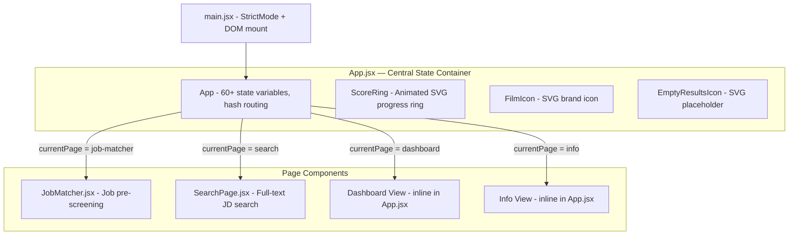
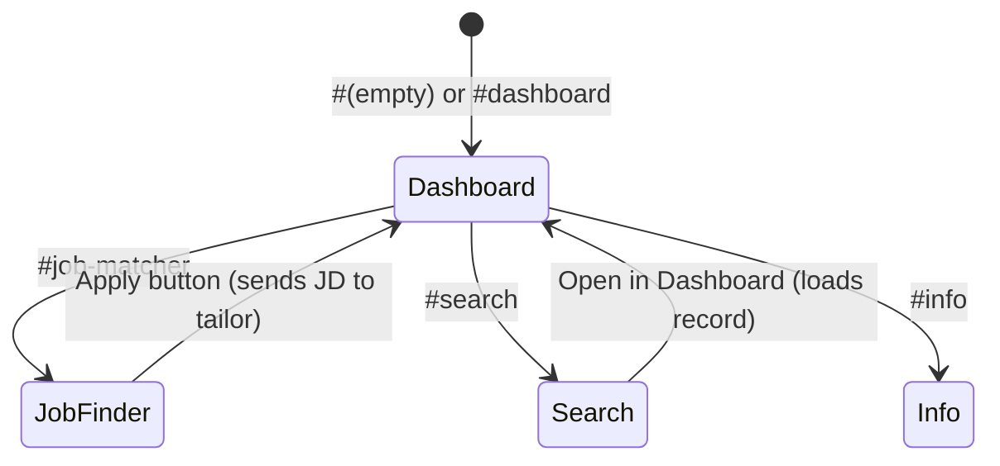
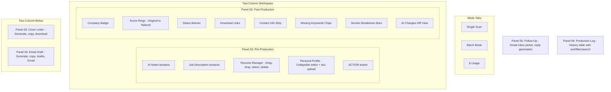
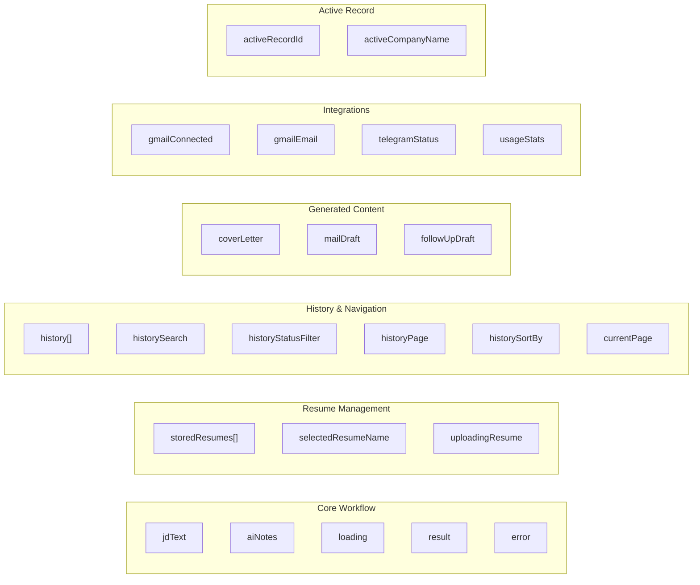
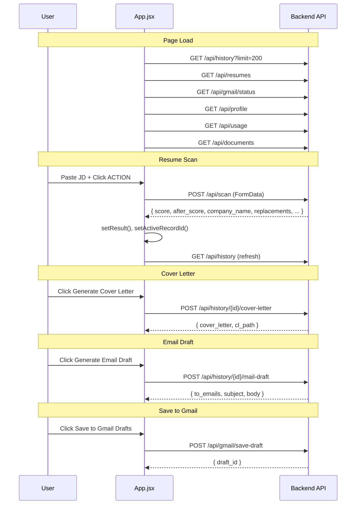

# Frontend Architecture

The frontend is a React 19 Single Page Application built with Vite 8. It uses vanilla CSS with CSS custom properties for theming — no external UI library.

## Component Hierarchy

## Navigation Architecture

The app uses URL hash-based routing managed by `useState` + `window.location.hash`:

### Sidebar Navigation

All pages share a persistent left sidebar with four navigation buttons:
- **Resume Tailor** — Main dashboard
- **Job Finder** — Pre-screening
- **Search** — Full-text search
- **Info** — Employer details, Telegram bot status, saved addresses

## Dashboard Layout (App.jsx)

The dashboard is the primary interface, organized as numbered panels:

## State Management

All state is managed via `useState` hooks in `App.jsx`. Key state groups:

### State Persistence

| State | Storage | Mechanism |
|-------|---------|-----------|
| `selectedResumeName` | `localStorage` | Read on mount, write on change |
| `currentPage` | URL hash | `window.location.hash` |
| `history` | Backend DB | Fetched via `GET /api/history` |
| All other state | Memory | Lost on page refresh |

## Component Details

### App.jsx (~1960 lines)

The monolithic root component handles:

- **Resume Management**: Upload (drag-drop or file picker), select, delete base resumes
- **Single Scan**: JD input -> pre-screening rules -> Gemini AI analysis -> tailored resume output
- **Batch Mode**: Process up to 10 JDs sequentially against selected resume
- **Cover Letter**: Generate via Gemini, copy to clipboard, download DOCX
- **Email Draft**: Generate via OpenAI, copy all, open in mail app, save to Gmail drafts
- **Follow-Up**: Select from Gmail inbox or paste email, generate contextual reply
- **Production Log**: Paginated history table (20/page) with sort (date/score/company/status), filter by status, search by company name, expandable JD preview
- **Usage Dashboard**: API cost tracking with daily/weekly/monthly/all-time breakdowns by model and operation
- **Personal Profile**: Collapsible editor for work authorization, location, availability. Supports document upload for fact extraction.
- **Info Page**: Employer details, Telegram bot configuration status, saved addresses with search

### JobMatcher.jsx (~860 lines)

Standalone job pre-screening component with inline styles:

- URL input with "Fetch JD" button to scrape job posting text
- JD text area with Ctrl+Enter shortcut
- Three view states: input form, analysis results, hard rejection
- Analysis results show: match %, company info, employment type, warnings, skills breakdown bars, detected keywords by category, source URL
- "Apply — Tailor Resume" button sends JD back to dashboard

### SearchPage.jsx (~236 lines)

Full-text search interface:

- Search input with Enter key trigger (min 2 chars)
- Results show: company name, score badge, status badge, position, location, local-only flag, date, emails (click to copy), recruiter name
- Per-record address editing with save/cancel
- Expandable JD preview
- "Open in Dashboard" button to load record in main view

### ScoreRing (inline component)

Animated SVG circular progress indicator:
- Uses `requestAnimationFrame` for smooth 900ms cubic-bezier animation
- Stroke-dasharray/dashoffset technique on SVG circle
- Color-coded: green (>=85%), gold (>=60%), red (<60%)

## Styling

### CSS Custom Properties (index.css)

The app uses a dark cinema-inspired theme:

| Variable | Value | Usage |
|----------|-------|-------|
| `--ink` | Dark background | Page/panel backgrounds |
| `--cream` | Light text | Primary text color |
| `--gold` | Warm accent | Buttons, highlights, panel borders |
| `--success` | Green | High scores, connected status |
| `--danger` | Red | Low scores, errors, rejections |
| `--muted` | Gray | Labels, secondary text |
| `--panel` | Dark panel | Card backgrounds |
| `--border` | Subtle line | Dividers, input borders |
| `--font-display` | Serif | Headers (h1, panel titles) |
| `--font-mono` | Monospace | Labels, scores, badges |
| `--font-body` | Sans-serif | Body text, textareas |

### UI Patterns

- **Panel system**: Numbered panels (`01 Pre-Production`, `02 Post-Production`, etc.) with gold top border
- **Film/cinema metaphor**: "TRAILERD" branding, film strip icon, production terminology
- **Entrance animations**: `panel-enter` CSS animation with staggered `animationDelay`
- **Responsive grid**: `workspace` class uses CSS Grid for two-column layout

## Data Flow: Frontend to Backend

