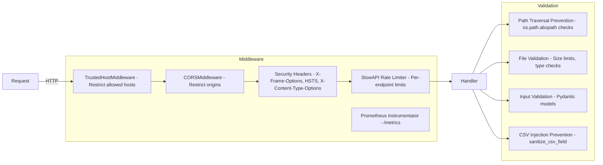

# System Architecture

## High-Level Architecture Diagram

```mermaid
graph TB
    User((User))

    subgraph Frontend ["Frontend - React 19 + Vite 8 (no router, hash-based views)"]
        CC["CommandCenter.jsx - Home / job pipeline"]
        JDW["JobDetailWorkspace.jsx - Per-job AI actions"]
        App["App.jsx - Resume Tailor + Info + shared state"]
        JM["JobMatcher.jsx - Job pre-screening"]
        JMS["JobMatches.jsx - All matches list"]
        IB["InboxPage.jsx - Gmail inbox browser"]
        SP["SearchPage.jsx - Full-text search"]
    end

    subgraph Backend ["Backend - FastAPI + Uvicorn (single main.py, ~5000 lines)"]
        Router["main.py - Routes + business logic"]

        subgraph Services ["services/"]
            AIS["ai_service.py - Gemini"]
            OLS["ollama_service.py - OpenAI (misleading filename)"]
            DXS["docx_service.py - DOCX read/write"]
            GMS["gmail_service.py - Gmail OAuth2 + API"]
            TGS["telegram_service.py - Telegram HTTP client"]
            TGN["telegram_notifier.py - Action-queue digest"]
            PFS["profile_service.py - Document OCR"]
            UTS["usage_tracker.py - Cost tracking"]
            SCH["scheduler.py - Daily auto-search schedule"]
            IM["inbox_matcher.py - Reply-to-application matching"]
            IC["inbox_cache.py - Inbox AI-classify cache"]
            SS["scan_status.py - Last-scan bookkeeping"]
            MC["model_config.py - Gemini model constants"]
        end

        DB[("SQLite - resumes.db (one table)")]
        FS[("File System - trailerd/ + online-platform/ + original/")]
    end

    subgraph External ["External Services"]
        Gemini["Google Gemini API"]
        Claude["Anthropic Claude API"]
        OpenAI["OpenAI API - GPT-4o-mini"]
        Gmail["Gmail API - OAuth2"]
        TGBot["Telegram Bot API"]
        JSearch["JSearch (RapidAPI) / DuckDuckGo scrape"]
        Word["MS Word COM (docx2pdf, Windows only)"]
    end

    User -->|Browser| CC
    User -->|Telegram| TGBot
    CC --> JDW
    CC -->|REST API| Router
    App -->|REST API| Router
    JM -->|REST API| Router
    IB -->|REST API| Router
    SP -->|REST API| Router
    JDW -->|REST API| Router

    Router --> AIS
    Router --> OLS
    Router --> DXS
    Router --> GMS
    Router --> TGS
    Router --> TGN
    Router --> PFS
    Router --> UTS
    Router --> SCH
    Router --> IM
    Router --> IC
    Router --> SS
    Router --> DB
    Router --> FS
    Router -->|_score_jobs_with_claude| Claude
    Router -->|auto-search| JSearch
    DXS -.->|best-effort, Windows only| Word

    AIS -->|API Calls| Gemini
    OLS -->|API Calls| OpenAI
    GMS -->|OAuth2 + API| Gmail
    TGS -->|Long-Polling| TGBot
    PFS -->|Vision API| Gemini
```

## The Four Products, One Table

Everything above shares a single SQLite table (`resumes`), distinguished by the `source` column. This is the most important thing to understand before touching the backend:

| Product | `source` value | Entry point | Notes |
|---|---|---|---|
| Resume Tailor (Dashboard) | `dashboard` | `/api/scan`, `/api/batch-scan` | Status enum: `Scanned/Applied/Phone Screen/Interview/Offer/Rejected` |
| Job Finder (older, standalone) | `job-finder` | `/api/job-matcher/analyze` | Pass/reject + match % against your profile, no auto job discovery |
| Command Center (auto-discovery) | `command-center` | `/api/jobs/auto-search` | Status enum: `Found/Shortlisted/Applied/Interviewing/Offered/Rejected` — **deliberately different** from the Dashboard's enum (see `JOB_STATUS_VALUES`, `main.py` ~line 3905) |
| Manually-added jobs | `manual` | `/api/jobs/manual-add` | Goes straight to `Shortlisted` |

`jd_text` is overloaded too: for Dashboard/Job Finder records it's the literal JD; for Command Center records it's just the job **title**, with the real description living inside the `scan_result` JSON blob (`scan_result['description']`).

## Component Responsibilities

### Frontend (React SPA, no router — `currentPage` state + `window.location.hash`)

| Component | Role |
|-----------|------|
| `CommandCenter.jsx` | Home view. Pipeline funnel, Action Queue, job source health, career intel, auto-search trigger, opens `JobDetailWorkspace` on a job click. |
| `JobDetailWorkspace.jsx` | Modal overlay for one job: AI next-best-action, match explanation, contact discovery, draft generation (recruiter email / follow-up / LinkedIn message), status tracker. Opened from Command Center, `JobMatches`, or `InboxPage`. |
| `App.jsx` | Central state container for the Resume Tailor dashboard (scan/batch/history/cover-letter/mail/follow-up/profile/usage) **and** the standalone Info page (Telegram status, saved addresses). ~79 `useState` calls. |
| `JobMatcher.jsx` | "Job Finder" — single-JD or URL pre-screening against the user profile, independent of Command Center's auto-discovery. |
| `JobMatches.jsx` | Paginated list of every Command Center "Found" job, drills into `JobDetailWorkspace`. |
| `InboxPage.jsx` | Gmail inbox browser with AI category classification, matched-application banner, reply drafting, label/archive/mark-read actions. |
| `SearchPage.jsx` | Full-text search across all records, with inline-editable address/notes per record. |

There is **no shared API client** — every component does its own `fetch()` against a hardcoded `http://localhost:8000` base URL. There's also no React Router; navigation is a `currentPage` string persisted to `window.location.hash`.

### Backend Services

| Service | Technology | Purpose |
|---------|-----------|---------|
| `ai_service.py` | Google Gemini | ATS score/tailoring, cover letters, job metadata, inbox message classification/summarization. 3-model fallback chain via `model_config.py`. |
| `ollama_service.py` | OpenAI GPT-4o-mini | Mail draft + follow-up generation, W2/full-time auto-detection. Filename is a holdover from an earlier Ollama-based version — it is **not** Ollama today. |
| `docx_service.py` | python-docx | Extracts text from DOCX, tailors DOCX via fuzzy find/replace preserving formatting. |
| `gmail_service.py` | Gmail API | OAuth2, drafts with multi-attachment support, inbox search/read, labeling/archiving. |
| `telegram_service.py` | Telegram Bot API | Low-level HTTP client (send/getUpdates/answerCallbackQuery) used by `main.py`'s poll loop and `telegram_notifier.py`. |
| `telegram_notifier.py` | — | Diffs the Action Queue against what's already been sent, pushes new items + a daily digest. 30-min background loop. |
| `profile_service.py` | Gemini Vision + pdfplumber | OCR/fact-extraction from uploaded profile documents; raw file is discarded, only extracted facts are kept. |
| `usage_tracker.py` | Local JSON file | Per-call cost tracking across all three AI providers; daily/weekly/monthly/all-time breakdowns; JSearch free-tier quota meter. |
| `scheduler.py` | Local JSON file | Daily auto-search schedule config + the loop that runs it and sends a Telegram digest. |
| `inbox_matcher.py` | Zero-AI-cost heuristics + Gemini classification | Matches an incoming Gmail message to a tracked application (domain → company-name → job-title match), notifies via Telegram. 30-min background loop. |
| `inbox_cache.py` | Local JSON file | Caches Gmail inbox AI-classification results by message id + content hash, so re-opening the inbox doesn't re-pay for classification. |
| `scan_status.py` | Local JSON file | Records the timestamp/platforms/query/count of the most recent Command Center auto-search. |
| `model_config.py` | — | Named Gemini model constants so no call site hardcodes a model string. |
| `whatsapp_service.py` | Twilio | **Dead code** — complete but never imported anywhere. |
| `search_cache.py` | Local JSON file | **Dead code** — empty-search-result cache, never wired into the auto-search pipeline. |

### Data Storage

| Store | Location | Contents |
|-------|----------|----------|
| SQLite Database | `data/resumes.db` | Single `resumes` table serving all four products (23 columns — see [Backend Architecture](Backend_Architecture.md)) |
| File System — Originals | `original/` | Uploaded base resume DOCX files |
| File System — Dashboard/Job Finder output | `trailerd/<company>/` | Tailored `Teja_Mahesh_Neerukonda_Resume.docx` + matching `.pdf`, `jd_info.txt`, `difference.txt`, `cover_letter_*.docx`, `mail_draft_*.txt` |
| File System — Command Center output | `online-platform/<company>_<job_id>/` | Same artifact types, keyed deterministically by job id instead of name-dedup counters |
| CSV History | `data/history.csv` | Append-only CSV log with hyperlinks to all generated files |
| API Usage | `data/api_usage.json` | Token counts and costs per API call, across Gemini/Claude/OpenAI |
| Gmail Tokens | `data/gmail_tokens.json` | OAuth2 refresh tokens |
| User Profile | `data/profile.txt` | Extracted personal facts (work authorization, location, availability) |
| Personal Documents | `data/documents/` | Uploaded DL/GC files for email attachments |
| Command Center bookkeeping | `data/last_scan.json`, `data/daily_search_schedule.json`, `data/telegram_notified_ids.json`, `data/inbox_classify_cache.json`, `data/inbox_reply_seen.json`, `data/inbox_reply_matches.json` | Scheduling, dedup, and caching state for the background loops |

## Background Jobs

Four `asyncio` tasks are started as FastAPI `@app.on_event("startup")` handlers (`main.py` ~3643-3666) and run for the life of the process:

| Loop | Cadence | Gated on | Purpose |
|---|---|---|---|
| `_telegram_poll_loop()` | Continuous long-poll | `TELEGRAM_BOT_TOKEN` set | Processes incoming Telegram messages/commands/callback buttons |
| `telegram_notifier.telegram_notify_loop()` | Every 30 min | `TELEGRAM_BOT_TOKEN` set | Pushes new Action Queue items to Telegram |
| `scheduler.daily_search_loop()` | Daily, configurable time (default 10:00 AM America/New_York) | Always runs; checks its own enabled flag each tick | Runs the default Command Center auto-search, sends a Telegram digest |
| `inbox_matcher.inbox_reply_check_loop()` | Every 30 min | Gmail connected | Scans recent inbox for replies matching tracked applications |

All four are best-effort and never raise — a failure in one doesn't take down the server or the other loops.

## Security Architecture

### Rate Limits

| Endpoint Group | Limit |
|---------------|-------|
| Resume scan (`/api/scan`) | 10/minute |
| Batch scan (`/api/batch-scan`) | 3/minute |
| Cover letter / Mail / Follow-up generation | 5/minute |
| History / Search / Command Center reads | 30-60/minute |
| Gmail operations | 10-20/minute |
| Job matcher analysis | 30/minute |

## A Known Sharp Edge

The hard-reject pre-screening rules (visa eligibility, lead/management role, foreign-language requirement, experience cap) are implemented as standalone helper functions in `main.py` (`_check_visa_eligibility`, `_check_lead_role`, etc.) and are called independently from **at least four places**: `/api/scan`, `/api/batch-scan`, the Telegram JD handler, and the Command Center auto-search pipeline. There is no single shared validator — if you change a rule, grep for the helper function name rather than assuming one call site covers everything.
