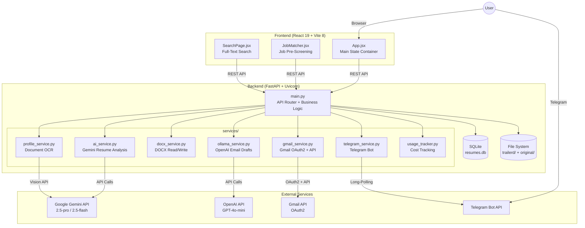
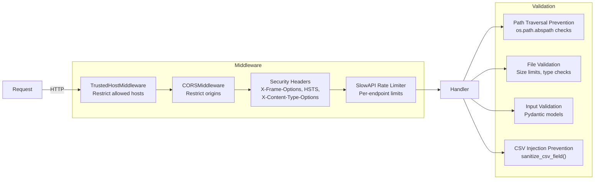

# System Architecture

## High-Level Architecture Diagram

## Component Responsibilities

### Frontend (React SPA)

| Component | Role |
|-----------|------|
| `App.jsx` | Central state container with 60+ state variables. Renders all pages: Dashboard (Resume Tailor), Job Finder, Search, Info. Manages resume upload, JD scanning, cover letter/email generation, batch mode, history, and Gmail integration. |
| `JobMatcher.jsx` | Pre-screening interface. Accepts JD text or URL, runs eligibility checks (visa, employment type, experience, role level), displays match percentage and skill breakdown. |
| `SearchPage.jsx` | Full-text search across all processed JDs. Shows company, position, emails, location, local-only status. Supports per-record address editing. |

### Backend Services

| Service | Technology | Purpose |
|---------|-----------|---------|
| `ai_service.py` | Google Gemini | ATS score calculation, resume bullet-point rewriting, company name extraction, cover letter generation, job metadata analysis. Uses a 3-model fallback chain (2.5-pro -> 2.5-flash -> 2.0-flash). |
| `ollama_service.py` | OpenAI GPT-4o-mini | Email draft generation (initial outreach + follow-up replies). W2/full-time auto-detection with automatic decline drafts. Recruiter name/job title extraction from JD signatures. |
| `docx_service.py` | python-docx | Extracts text from DOCX (paragraphs + tables). Creates tailored DOCX by performing fuzzy string replacement across runs while preserving formatting. |
| `gmail_service.py` | Google Gmail API | OAuth2 authentication flow. Creates Gmail drafts with multi-attachment support (resume, cover letter, DL, GC). Inbox search and message reading for follow-up workflows. |
| `telegram_service.py` | Telegram Bot API | Async long-polling for incoming messages. Processes JDs sent via chat, runs the full scan pipeline, replies with score and status. |
| `profile_service.py` | Gemini Vision + pdfplumber | Extracts job-relevant facts from uploaded personal documents (PDF, DOCX, images). Uses OCR for scanned documents. Merges extracted facts into the user profile. |
| `usage_tracker.py` | Local JSON file | Tracks all API calls with per-model token counts and cost calculation. Provides daily/weekly/monthly/all-time breakdowns. |

### Data Storage

| Store | Location | Contents |
|-------|----------|----------|
| SQLite Database | `data/resumes.db` | All scan records: company name, JD text, ATS score, file paths, status, scan results (JSON), employment type, match percentage, source URL |
| File System - Originals | `original/` | Uploaded base resume DOCX files |
| File System - Tailored | `trailerd/<company>/` | Per-company output: tailored `resume.docx`, `jd_info.txt`, `difference.txt`, `cover_letter_*.docx`, `mail_draft_*.txt` |
| CSV History | `data/history.csv` | Append-only CSV log with hyperlinks to all generated files |
| API Usage | `data/api_usage.json` | Token counts and costs per API call |
| Gmail Tokens | `data/gmail_tokens.json` | OAuth2 refresh tokens for Gmail integration |
| User Profile | `data/profile.txt` | Extracted personal facts (work authorization, location, availability) |
| Personal Documents | `data/documents/` | Uploaded DL/GC files for email attachments |

## Security Architecture

### Rate Limits

| Endpoint Group | Limit |
|---------------|-------|
| Resume scan (`/api/scan`) | 10/minute |
| Batch scan (`/api/batch-scan`) | 3/minute |
| Cover letter / Email generation | 5/minute |
| History / Search reads | 30-60/minute |
| Gmail operations | 10-20/minute |
| Job matcher analysis | 30/minute |
